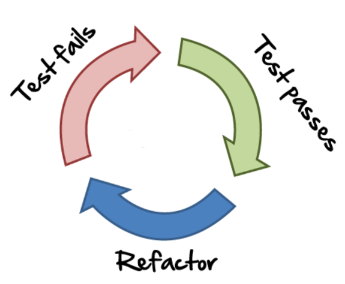
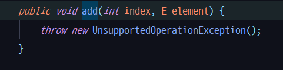

# 레벨1 정리

---

### 우아한테크코스에서 뭘 배웠나요?

### 레벨 1 - 프로그래밍 기본

- 자바 프로그래밍 언어에 대한 `기본 문법`을 익혀 프로그래밍하는 경험을 한다.
- `읽기 좋은 코드(클린코드)`를 구현하는 것이 왜 중요한지와 코드를 개선해 읽기 좋은 코드로 변경해 보는 경험을 한다.
- 자신이 구현한 코드에 대해 `단위 테스트와 리팩토링`하는 경험을 한다.
- 웹 프론트엔드에서 웹 백엔드까지 프로그래밍해 `웹 애플리케이션을 개발하는 경험`을 한다.

**기본적인 자바 프로그래밍 언어의 문법과 자바8을 학습하였다.** 

- **객체지향 생활체조와 클린 코드의 원칙, SOLID 등의 원칙을 지키며 읽기 좋은 코드를 작성하는 연습을 하였다.**

    기본적으로 코딩 컨벤션을 지키는 연습부터 시작해 들여쓰기를 적게 유지하고 else를 사용하지 않고, getter setter 프로퍼티 사용을 지양하고 일급 컬렉션이나 원시값을 래핑하여 사용하는 것, 디미터 법칙을 위배하지 않는 것, 메서드의 길이를 짧게 하는 것 등을 몸에 익히는 시간이었다.

    ### 객체지향 생활 체조

    [규칙 1: 한 메서드에 오직 한 단계의 들여쓰기만 한다.](https://developerfarm.wordpress.com/2012/01/26/object_calisthenics_2/)

    [규칙 2: else 예약어를 쓰지 않는다.](https://developerfarm.wordpress.com/2012/01/27/object_calisthenics_3/)

    [규칙 3: 모든 원시값과 문자열을 포장한다.](https://developerfarm.wordpress.com/2012/01/27/object_calisthenics_4/)

    [규칙 4: 한 줄에 점을 하나만 찍는다.](https://developerfarm.wordpress.com/2012/01/30/object_calisthenics_5/)

    [규칙 5: 줄여쓰지 않는다(축약 금지).](https://developerfarm.wordpress.com/2012/01/30/object_calisthenics_6/)

    [규칙 6: 모든 엔티티를 작게 유지한다.](https://developerfarm.wordpress.com/2012/01/31/object_calisthenics_7/)

    [규칙 7: 2개 이상의 인스턴스 변수를 가진 클래스를 쓰지 않는다.](https://developerfarm.wordpress.com/2012/01/31/object_calisthenics_8/)

    [규칙 8: 일급 콜렉션을 쓴다.](https://developerfarm.wordpress.com/2012/02/01/object_calisthenics_/)

    [규칙 9: 게터/세터/프로퍼티를 쓰지 않는다](https://developerfarm.wordpress.com/2012/02/01/object_calisthenics_10/).

    [https://developerfarm.wordpress.com/2012/02/03/object_calisthenics_summary/](https://developerfarm.wordpress.com/2012/02/03/object_calisthenics_summary/)

    ### SOLID

    - SRP (단일책임의 원칙: Single Responsibility Principle)
        - 작성된 클래스는 하나의 기능만 가지며 클래스가 제공하는 모든 서비스는 그 하나의 책임(변화의 축: axis of change)을 수행하는 데 집중되어 있어야 한다.
        - 단일책임 원칙을 지키기 위해 네이밍하는 데에 신경을 쓴다. 해당 메서드와 클래스가 주어진 이름에 한정지어진 역할만 하도록 함.
    - OCP (개방폐쇄의 원칙: Open Close Principle)
        - 소프트웨어의 구성요소(컴포넌트, 클래스, 모듈, 함수)는 확장에는 열려있고, 변경에는 닫혀있어야 한다.
        - interface를 주입 받아 사용하고 해당 interface를 타입으로 하는 구체적이고 다양한 strategy를 만들어 사용함으로써 확장성을 높이고 변경 가능성을 낮추는 연습을 해봄. 이러한 작업은 test 코드를 작성하는데에도 도움이 되었다.
    - LSP (리스코브 치환의 원칙: The Liskov Substitution Principle)
        - 서브 타입은 언제나 기반 타입으로 교체할 수 있어야 한다. 즉, 서브 타입은 언제나 기반 타입과 호환될 수 있어야 한다.
    - ISP (인터페이스 분리의 원칙: Interface Segregation Principle)
        - 한 클래스는 자신이 사용하지 않는 인터페이스는 구현하지 말아야 한다.
    - DIP (의존성역전의 원칙: Dependency Inversion Principle)
        - 구조적 디자인에서 발생하던 하위 레벨 모듈의 변경이 상위 레벨 모듈의 변경을 요구하는 위계관계를 끊는 의미의 역전 원칙이다.
        - 웹 프로그래밍을 할 때 Cotroller, service, repository등의 각 레이어가 각각의 위계관계를 끊고 의존성을 낮추는 연습을 하였다. (이거 예시 맞음?)

- **TDD와 단위 테스트를 처음 경험하고 그 방법과 의미를 체득하였다.**

    TDD를 함으로써 처음 느꼈던 것은 코드 없이 직접 프로그램을 실행시켜서 테스트하는 것이 얼마나 불확실하고 비효율적인지 알 수 있었다. 테스트 코드가 없으면 눈을 감고 더듬거리며 프로그램이 대충 잘 작동하는지만 확인하는 것같이 느껴졌다.

    또한 메서드의 역할과 책임이 하나에 집중되도록 설계하는 데 도움이 되었다.

    리팩토링을 할 때도 안심하고 코드를 수정하고 구조를 변경할 수 있었다.

    TDD는 구조 설계, 안전한 리팩토링, 효율적인 테스트에 장점이 있는 것 같다.

    

    TDD의 장점

    - 디버깅 시간을 줄여준다.
    - 동작하는 문서 역할을 한다.
    - 변화에 대한 두려움을 줄여준다.

    - 원칙 1 - 실패하는 단위 테스트를 작성할 때까지 프로덕션 코드(production code)를 작성하지 않는다.
    - 원칙 2 - 컴파일은 실패하지 않으면서 실행이 실패하는 정도로만 단위 테스트를 작성한다.
    - 원칙 3 - 현재 실패하는 테스트를 통과할 정도로만 실제 코드를 작성한다.

- git을 이용해 프로젝트를 관리하는 것을 해봤다

    현업에서 사용하는 것과 같은 git flow를 적용해 미션을 진행한 것은 아니지만 commit메시지를 신경쓰면서 작성하고 브랜치를 나누어 작업하고, pr을 보내고 코드리뷰를 하는 일련의 과정이 익숙해졌다.

- 페어 프로그래밍.

    처음하는 페어프로그래밍. 

    처음에는 내가 잘못하고 있는 건 아닌지 두려움과 혼자하는 것보다 속도가 나지 않는 비효율을 경험했지만

    점차 부족한 점을 서로 채울 수 있고 틀린 의견이 아닌 다른 의견들을 많이 접하면서 다양한 생각을 할 수 있게 되었다.

    단기적으로는 효율성이 떨어지던 작업이 장기적으로 보면 코드에 대한 커뮤니케이션 효율을 올려주고 단단하게 구조를 잡아갈 수 있게 하였다. 실수를 서로 보완해주기 때문에 삽질 하는 경우가 줄어들었다.

---

# 읽은 책

### 객체지향의 사실과 오해

객체지향은 '객체'를 지향하는 것이지 '클래스'를 지향하는 것이 아니다. 객체지향적인 사고의 시작은 클래스 중심으로 사고하던 것을 객체와 객체 간의 협력으로 바꾸는 것이다.

객체지향적으로 프로그래밍 하는 것은, 자율적이면서 개방적인 객체들이 각자의 명확한 역할과 책임을 가지고 다른 객체와 협력하는 프로그램을 설계하는 것.

객체는 상태와 행동을 가지며 메시지를 주고 받는다.

### 개발자가 반드시 정복해야 할 객체지향과 디자인 패턴

인터페이스를 사용하자.

## 인터페이스란?

하나의 시스템을 구성하는 2개의 구성 요소(하드웨어, 소프트웨어) 또는 2개의 시스템이 상호 작용할 수 있도록 접속되는 경계(boundary), 이 경계에서 상호 접속하기 위한 하드웨어, 소프트웨어, 조건, 규약 등을 포괄적으로 가리키는 말

- interface는 자바에서 한 단계 더 높은 추상화를 하기 위해 사용된다.
- interface는 구현 로직은 존재하지 않으며 메소드에 대한 입력(input), 출력(output)만 정의하고 있다.
- interface를 활용해 추상화를 하는 이유는 소프트웨어에 변경이 발생할 경우 소스 코드에 변경을 최소화함으로써 유지보수 비용을 줄이고, 변화에 빠르게 대응하기 위함이다.
- 추상화를 함으로써 미래의 변화에 빠르게 대응할 수 있지만 추상화를 하려면 추상화에 따른 개발 비용이 발생한다.

## Exception

---

### 자잘한 팁들 및 피드백 정리

- 메서드의 파라미터에 final을 선언해서 사용하기
- 인스턴스 변수를 최소화 하라. 다른 인스턴스 변수로 구할 수 있는 거를 굳이 인스턴스 변수로 만들지 마라
- Setter 사용하지 말자
- get하지 말고 메시지를 보내자! (디미터 법칙)
- String + String 대신 StringBuilder를 사용하자
- Arrays.asList()
    1. Arrays.asList()는 **java.arrays.ArrayList** 클래스를 리턴하는 것으로 **java.util.ArrayList** 클래스와는 다르다.
    2. java.util.arrays.ArrayList는 원소를 추가하는 메서드를 가지고 있지 않기 때문에 **Arrays.asList()가 리턴한 ArrayList는 사이즈를 바꿀 수 없다.**

        String[] arr = {"가", "나", "다"};
        List<String> strList = Arrays.asList(arr);
        		
        strList.add("우와우와");
        		
        System.out.println(strList);
        
        
        Exception in thread "main" java.lang.UnsupportedOperationException
        	at java.util.AbstractList.add(Unknown Source)
        	at java.util.AbstractList.add(Unknown Source)
        	at practice.abc.main(abc.java:12)

    1. 아래와 같은 방법을 사용하면 배열을 요소를 추가할 수 있는 리스트로 변환하여 사용할 수 있다.

    `List<String> newStrList = new ArrayList<>(Arrays.asList(arr));`

    

    

- 정적 메서드의 사용을 지양하자!

    정적 메서드는 테스트 하기 어렵고 객체지향적이지 않기 때문에 사용을 지양해야 한다.

    보통 유틸리티 클래스를 작성할 때나 팩토리 패턴에서 사용된다

    [https://github.com/soojinroh/Today_I_Learned/blob/master/TIL(2019-05-22) static method.md](https://github.com/soojinroh/Today_I_Learned/blob/master/TIL(2019-05-22)%20static%20method.md)

- Collection.unmodifiableList()를 사용하자.
- String.matches와 Matcher.matches

    [https://github.com/soojinroh/Today_I_Learned/blob/master/TIL(2019-05-22) String.matches와 Matcher.matches.md](https://github.com/soojinroh/Today_I_Learned/blob/master/TIL(2019-05-22)%20String.matches%EC%99%80%20Matcher.matches.md)

- 조건절도 메서드로 분리하자.
- exception을 흘려보내지 말자

    [https://www.slipp.net/questions/350](https://www.slipp.net/questions/350)

    [http://wonwoo.ml/index.php/post/878](http://wonwoo.ml/index.php/post/878)

- 무분별하게 클래스 변수를 선언하지 말자

    객체 속성이면 클래스 변수로 선언해주세요

- 태그달린 클래스보다는 계층구조를 활용하라

    태그 달린 클래스는 하나의 클래스가 2가지 이상의 기능을 가지고 있어 기능이 혼합되고 해당 클래스로 생성된 객체는 불필요한 필드를 가지게 되는 단점이 있다. 

- try-with-resources를 사용하자
- Optional

    [https://github.com/soojinroh/Today_I_Learned/blob/master/TIL(2019-05-27) Optional.md](https://github.com/soojinroh/Today_I_Learned/blob/master/TIL(2019-05-27)%20Optional.md)

- GRASP 원칙

    [http://contents.kocw.or.kr/KOCW/document/2014/Seowon/SongHaesang/08.pdf](http://contents.kocw.or.kr/KOCW/document/2014/Seowon/SongHaesang/08.pdf)