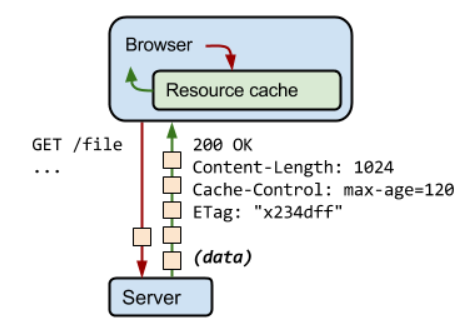
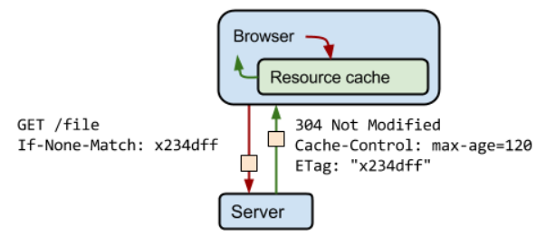
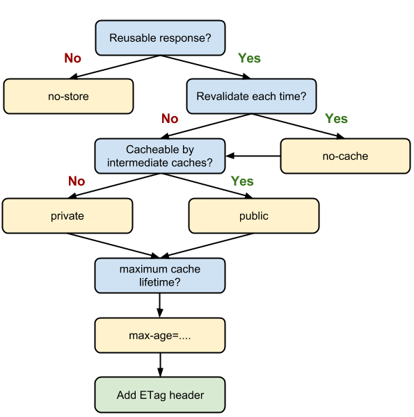

# Cache

HTTP 완벽가이드 7장 캐시

[https://www.notion.so/sooreal/7-297871de981247b39cd3c998ae9bbea1](https://www.notion.so/sooreal/7-297871de981247b39cd3c998ae9bbea1)

cache란? [위키]

나중에 필요할 수도 있는 무언가를 저장하였다가 신속하게 회수할 수 있는 보관장소로, 어떤 식으로든 보호되거나 숨겨진다.

원본 데이터와는 별개로 자주 쓰이는 데이터를 복사해둘 캐시 공간을 마련한다. 

데이터에 대한 요청이 들어오면 원본 데이터가 담긴 곳에 접근하기 전에 먼저 캐시 내부부터 검색한다.

캐시에 원하는 데이터가 없거나 너무 오래되어 최신성을 잃었으면 그때 원본 데이터가 저장되어 있는 곳에 접근하여 데이터를 가져온다. 이때 캐시에도 해당 데이터를 복사하거나 혹은 갱신한다. 

캐시에 원하는 데이터가 있고 그 데이터가 최신성을 담보한다면 원본 데이터에 접근하지 않고 캐시에 있는 데이터를 반납한다. 

캐시는 자주 요청되나 변경사항이 적은 파일에 대해서 불필요하게 중복되는 다운로드를 최소화해 성능을 개선하기 위한 작업이다. 

네트워크를 통해 자원을 가져오는 것은 생각보다 시간이 오래 걸린다. 빛의 속도로 광케이블을 타고 가더라도 미국과 한국 사이의 거리는 빛의 속도마저 느리게 느껴지게 한다.

효율적인 자원의 사용과 서비스의 속도와 관련된 이슈에서 중요한 문제라고 생각한다.

즉, 자주 사용되고 변경이 적은 파일은 원 서버의 앞에 캐시라는 공간에 저장해두어 빠르게 제공할 수 있게 해주는 것. 즉 자주 쓰는 것은 가까운 곳에 따로 보관해두어 즉시 제공할 수 있도록 하는 것이다.

### 이때 중요한 것은 이 파일의 최신성을 어떻게 담보할지.

파일의 내용이 변경되었는 지 무엇으로 확인하는가? ETag. 

브라우저가 자원을 처음 요청해서 받으면 Etag라는 것을 받아 저장해둔다. 

그리고 다음 요청에서 Etag를 같이 서버에 보내는데 동일한 자원에 대해 서버가 가지고 있는 Etag가 같으면 파일은 변경되지 않은 것이고 다르면 파일이 변경되었다는 것을 의미한다.

즉, Etag로 파일의 변경 상황을 알 수 있는것!

변경되었으면 다시 가져오고 변경되지 않았으면 캐시되어있는 것을 그대로 사용한다.

처음 자원을 요청해서 받을 때 ETag를 받음

두 번째 요청부터는 ETag를 자동으로 header에 생성해서 보냄

cache-control을 이용해서 캐시의 활용을 컨트롤 할 수 있다. 

캐시의 조건과 기간을 제어한다.

no-cache와 no-strore의 차이

no-store는 캐싱하지 않겠다는 뜻. max-age=0와 같음

- 'no-cache' 캐시를 사용하지 말라는 뜻이 아니라 캐시를 쓰기 전에 서버에 이 캐시 진짜 써도 되냐고 물어보라는 뜻이다. 응답 데이터를 캐쉬하고는 있지만, 일단 먼저 서버에 요청해서 유효성 검사(validation)을 하도록 강제한다. 어느정도 캐쉬의 효용을 누리면서도 컨텐츠의 freshness를 강제로 유지하는데 좋다.

그러면 스프링에서 어떻게 캐싱을 다루는가

[https://kdevkr.github.io/archives/2018/understanding-cache-control/](https://kdevkr.github.io/archives/2018/understanding-cache-control/)

### **동적인 컨텐츠는 어떻게 캐싱하나?**

PHP, ASP, JSP등의 서버사이드 프로그램을 통해서 동적으로 생성된 컨텐츠는 Last-Modified, ETag, Expires, Cache-Control 등의 정보가 없어서 손쉽게 캐쉬할 수 없다.

이러한 문제점을 해결하기 위해 다음과 같은 방법들이 사용가능하다.

1. 추천: 동적으로 생성된 컨텐츠를 파일로 저장해두고 정적인 컨텐츠처럼 취급한다. Last-Modified를 보존할 수 있도록 내용이 바뀔때만 새롭게 파일로 저장한다.
2. 응답 헤더에 freshness를 판별할 수 있도록 캐쉬 지시자를 추가
3. 2번으로 부족할경우 서버사이드 프로그램 자체에서 ETag 같은 validator를 생성하여 응답헤더에 추가하고, 클라이언트에서 http 요청이 올경우 이를 파싱하여 직접 validation을 한다.

자세한 정보를 더 알고 싶으면 여기로

[https://cyberx.tistory.com/9](https://cyberx.tistory.com/9)

파일 버전 변경

[https://yongdev91.tistory.com/1](https://yongdev91.tistory.com/1)