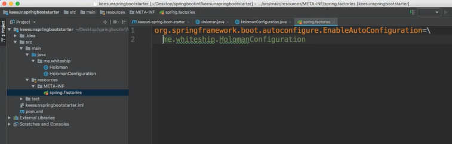
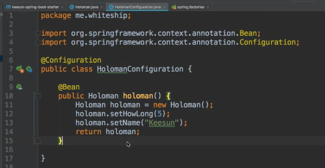
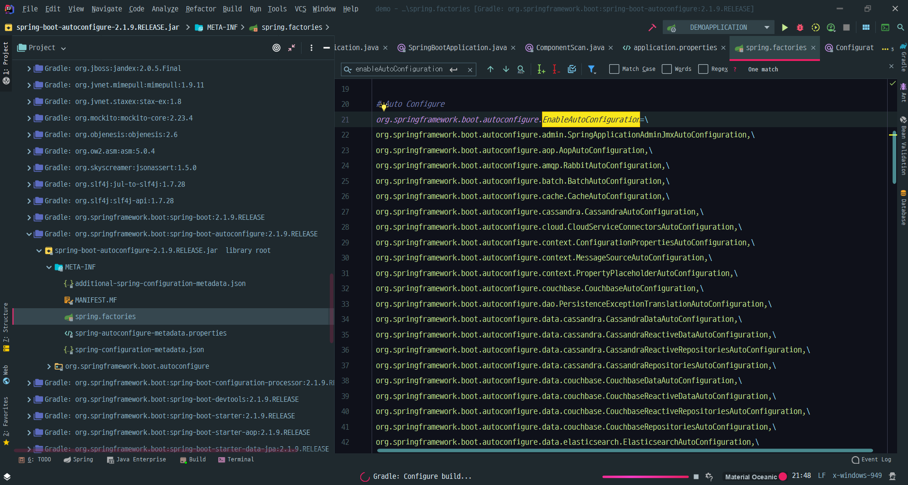
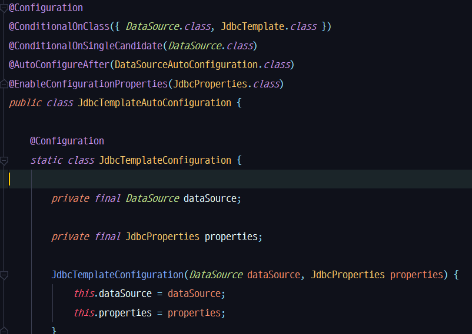
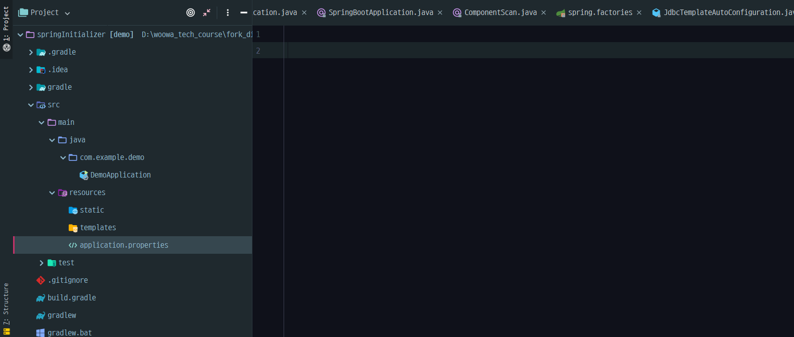
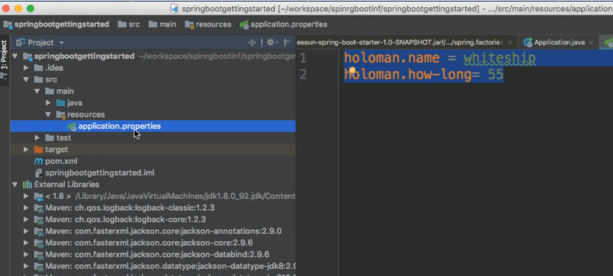

# SpringBoot 자동 구성 Annotation

@SpringBootApplication 애노테이션은 다음 세 가지의 주요한 애노테이션을 가지고 있다.

@SpringBootConfiguration

@EnableAutoConfigure

@ComponentScan

### @SpringBootConfiguration

@SpringBootConfiguration 애노테이션은 @Configuration 애노테이션과 사실상 같은 역할을 한다. Bean의 설정 파일.

### @EnableAutoConfigure와 @ComponentScan은 둘 다 Bean을 등록하는 역할을 한다.

### Bean을 등록하는 방식과 순서에 차이가 있다 @ConponentScan이 먼저 Bean을 등록하고 @EnableAutoConfiguration이 Bean을 등록한다.

### @ConponentScan

@Conponent라는 Annotation이 붙어있는 클래스를 읽고 Bean으로 등록함.

@SpringootApplication이라는 애노테이션이 달린 클래스가 있는 패키지의 하위 패키지에 있는 클래스를 읽어들인다.

@Component 애노테이션은 **@Component @Configuration @Repository @Service @Controller @RestController** 등에 등록되어 있다.

### @EnableAutoConfiguration

SpringBoot 프로젝트 내에 resources/META-INF/spring.factories라는 파일에 쓰여있는 파일을 찾아 bean으로 등록시켜줌.

org.springframework.boot.autoconfigure.EnableAutoConfiguration을 key로 하는 값들을 읽어들임.

이 클래스 파일을 찾아서 Bean annotation을 찾아 등록해줌

위의 방법은 커스텀하게 등록하는 것

스프링부트 프로젝트를 만들면 아래와 같이 이미 기본적으로 등록할 파일이 설정되어 있음.

org.springframeworkd.boot.autoconfigure.EnableAutoConfiguration을 키로 하는 파일들을 찾아 bean으로 등록함.

그러나 전부 다 Bean으로 등록하는 것은 아니고 @Conditional이라는 애노테이션을 보고 조건에 따라 Bean으로 등록을 한다. 이를 통해 개발자가 bean등록을 조작할 수 있음.

자동으로 등록되는 Bean의 상태를 수정하고 싶으면?

아래와 같이 application.properties에서 상태를 수정해줄 수 있다.

---

### @SpringBootApplication annotation이 어떤 작업을 수행하나요?

@SpringBootApplication은 @SpringBootConfiguraion과 @ComponentsScan, @EnableAutoConfiguration 애노테이션을 포함하는 애노테이션으로 Bean등록과 Bean을 설정하는 역할을 합니다.

@SpringBootApplication은 @Configuration과 같은데 Bean의 설정 정보를 담고 있는 파일을 찾아 등록해줍니다. 즉, Bean의 설정정보와 관련된 작업을 수행합니다.

그리고 @ComponentScan과 @EnableAutoConfiguration은 bean을 등록하는 역할을 합니다.

ComponentScan은 @Component 애노테이션을 찾아 bean으로 등록해주고 @EnableAutoConfiguration은 spring.factories파일에 설정되어 있는 파일을 찾아 Bean으로 등록해줍니다.

ComponentScan은 @SpringBootApplication 애노테이션이 등록된 클래스의 패키지 하위에 있는 파일만 scan한다는 특징이 있습니다.

ComponentScan이 먼저 적용되고 그 다음에 EnableAutoConfiguration이 적용됩니다.